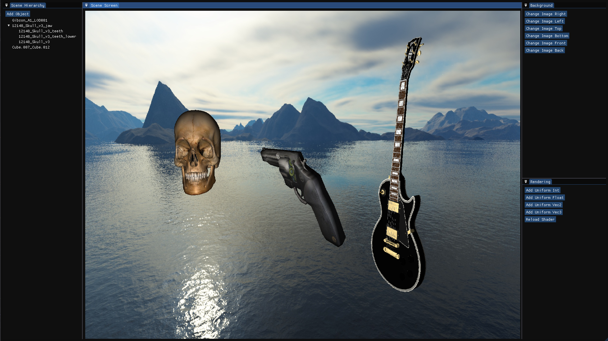

# Simple Render
  
Model by [Francesco Coldesina](https://sketchfab.com/3d-models/gibson-from-rickgreeve-cee58deadaa44425bbb4bf8f0ec46b44), [gabrielferreirasilveira21](https://free3d.com/3d-model/gun-54829.html), [printable_models](https://free3d.com/3d-model/skull-v3--785914.html)

Simple Render is an interactive model viewer written in C++ and OpenGL. Note this program does not feature any game-engine-like features such as physics or scripted objects.

## Features
* Scene Hierarchy
* Model and Texture Import, Background Image Swapping
* Object Manipulation (Transformation)
* Free Camera Movement
* Uniform Variables Interface and Dynamic Shader Loading
* Deferred Rendering

## Shader Programming
Simple Render supports deferred rendering, shader hot-reload and uniform variables. You can edit `SimpleRenderer/shaders/deferred_render/deferred_render.frag` and apply the changes without closing the application by clicking on `Reload Shader`.

Note that changing other scripts may cause Simple Render to malfunction.

As mentioned earlier, Simple Render also supports uniform variables. Click on `Add Uniform X` and change the name to the appropriate uniform variable.

## External Libraries
* OpenGL (GLFW & GLAD): Drawing API
* GLM: OpenGL compatible maths library
* stb_image: Image loader
* Assimp: 3D models importing library
* ImGUI: UI interface
* ImGuizmo: Gizmo interface
* WinAPI: File Dialog
* Scene Save & Load (If it works, it works)

## Features to Add
* Sophisticated Object Manipulation

## Known Issues
* Rotating an object to certain degree causes it to get stuck in the wrong orientation
* Choosing a different object while a texture is selected causes the texture to remain selected
* Objects sometimes do not get selected.
