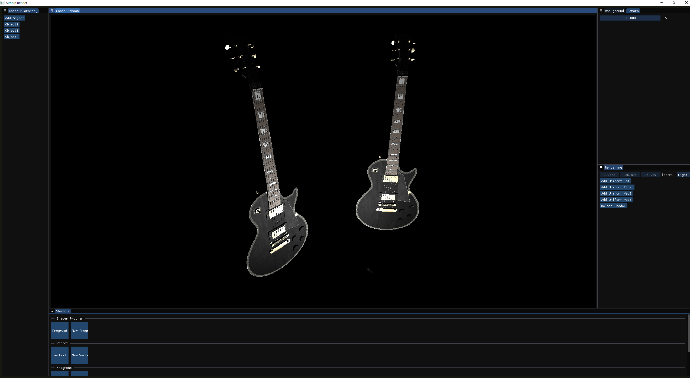

# Simple Render
Real time 3D objects visualisation tool using OpenGL  
  
Model by [Francesco Coldesina](https://sketchfab.com/3d-models/gibson-from-rickgreeve-cee58deadaa44425bbb4bf8f0ec46b44)

## Features
* Model Loading & Object Selection
* Object Manipulation (Position, Rotation, Scale; more features to be added)
* View Camera (FOV; more features to be added)
* Dynamic Shader Loading (No practical use as of now)
* Deferred Rendering & Communication between the app and deferred rendering shader

### External Libraries
* OpenGL (GLFW & GLAD): Drawing API
* GLM: OpenGL compatible maths library
* stb_image: Image loader
* Assimp: 3D models importing library
* ImGUI: UI interface
* ImGuizmo: Gizmo interface
* WinAPI: File Dialog

