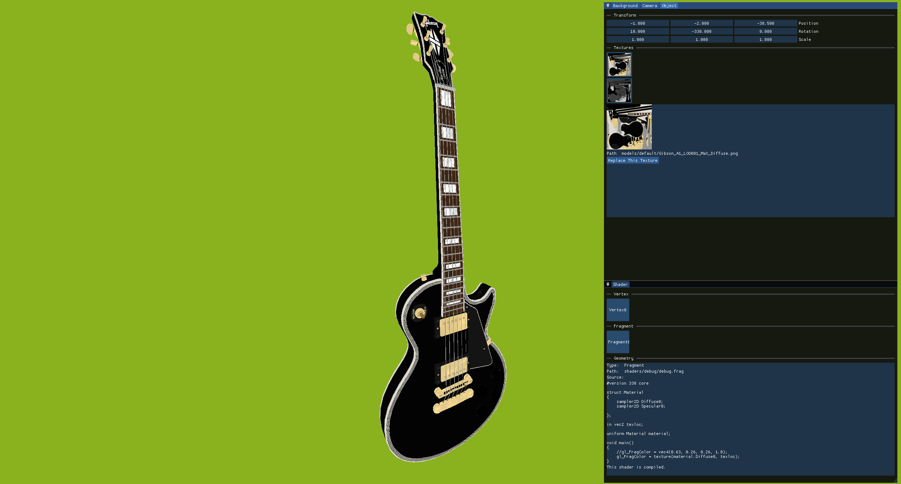

# Simple Render
Real time 3D objects visualisation tool using OpenGL  
  

## List of Classes

### External Libraries
* OpenGL (GLFW & GLAD): Drawing API
* GLM: OpenGL compatible maths library
* stb_image: Image loader
* Assimp: 3D models importing library
* ImGUI:: UI interface
* WinAPI: File Dialog

Classes are prefixed with 'Render' (e.g RenderCamera, RenderScene) to indicate that they belong to Simple Render.   
Concrete UI classes are a exception since their parent class is named RenderUI.  

To avoid circular dependency and share objects across multiple classes, Render objects are created using the new keyword. Exceptions exist where maintaining a single reference is insignificant.

### Classes that must be instiatiated on the heap:  

* RenderTexture
* RenderShader
* RenderShaderProgram
* RenderObject
* RenderScene
* RenderCamera
* All UI classes

### Classes that can be instantiated on the stack:
* RenderVertex
* RenderMesh

### Class Info:
* RenderVertex: Container for position, normal and texture coordinate for a vertex
* RenderMesh: A face in RenderObject
* RenderObject: A whole renderable object. Contains textures, shaders etc to draw the object.
* RenderTexture: 2D Texture.
* RenderShader: GLSL shader. Can be a vertex, fragment or geometry shader.
* RenderShaderProgram: shader program. Must have a vertex and a fragment shader to operate. Geometry shader is optional
* RenderCamera: Camera.
* RenderScene: Contains multiple RenderObjects, cameras, shaders etc.
* FileReader: Helper class to read files

